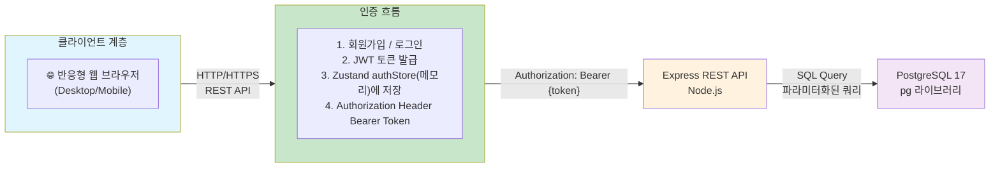
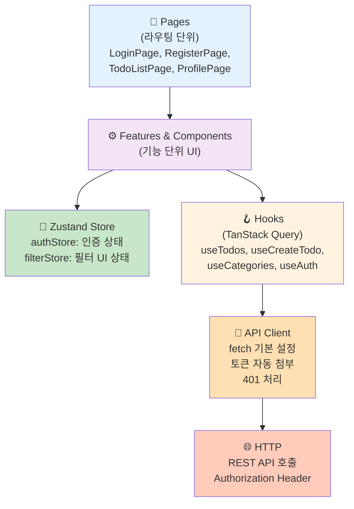
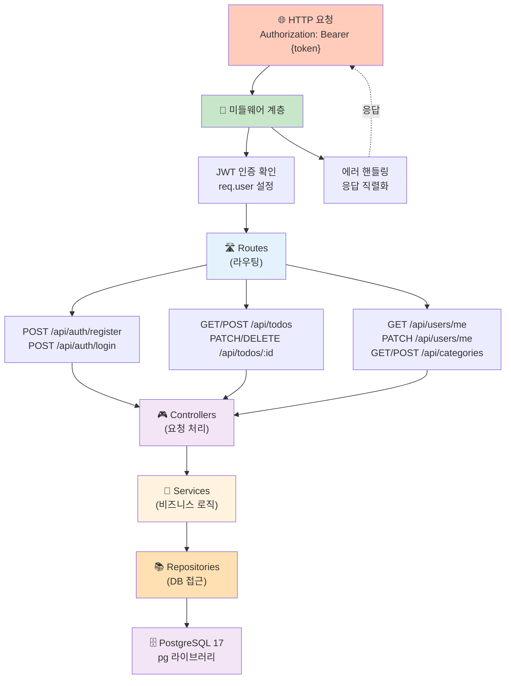
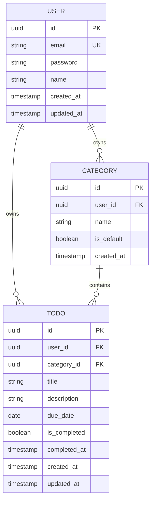

# TodoListApp 기술 아키텍처 다이어그램

- 버전: 1.0.0
- 작성일: 2026-05-13
- 참조 문서:
  - [도메인 정의서 v1.0.0](./1-domain-definition.md)
  - [PRD v1.1.0](./2-prd.md)
  - [프로젝트 원칙 v1.0.0](./4-project-principles.md)

---

## 변경 이력

| 버전 | 날짜 | 작성자 | 변경 내용 |
|------|------|--------|-----------|
| 1.0.0 | 2026-05-13 | Documentation Engineer | 최초 작성: 4개 다이어그램 (전체 구성, 프론트엔드 레이어, 백엔드 레이어, DB 엔티티) |

---

## 1. 전체 시스템 구성도

전체 시스템의 3-tier 아키텍처. 반응형 웹 브라우저에서 Express REST API를 거쳐 PostgreSQL 17에 접근하는 구조입니다.

---

## 2. 프론트엔드 레이어 구조

React 19 + TypeScript 기반의 프론트엔드 계층. Pages에서 시작하여 Features/Components → Hooks (TanStack Query) → API Client → HTTP 순으로 데이터가 흐르고, Zustand Store가 UI 상태와 인증 상태를 관리합니다.

---

## 3. 백엔드 레이어 구조

Express REST API의 레이어드 아키텍처. Routes → Controllers → Services → Repositories → PostgreSQL 순으로 계층화되어 있으며, JWT Auth Middleware와 Error Handler Middleware가 측면에서 요청/응답을 제어합니다.

---

## 4. DB 엔티티 관계도

도메인 정의서 기반의 3개 핵심 엔티티(User, Todo, Category) 관계도. User는 Todo와 Category의 소유자이며, Todo는 Category로 분류됩니다.

**주요 제약 조건:**
- **BR-U-01**: User.email은 전체 시스템에서 고유 (UNIQUE 제약)
- **BR-T-01**: Todo는 반드시 하나의 Category에 속함 (NOT NULL FK)
- **BR-T-03**: 사용자는 자신 소유의 Todo만 조회/수정/삭제 (user_id 검증)
- **BR-C-01**: 기본 카테고리(is_default=true)는 시스템 제공, 수정/삭제 불가
- **BR-C-02**: 사용자 정의 카테고리는 해당 사용자만 접근 (user_id 검증)
- **BR-C-03**: 할일이 있는 카테고리는 삭제 불가 (애플리케이션 검증)

---

## 주요 기술 스택

### 프론트엔드
- **Framework**: React 19 + TypeScript
- **상태 관리**: Zustand (UI/인증 상태)
- **서버 상태**: TanStack Query (API 데이터)
- **플랫폼**: 반응형 웹 (Desktop/Mobile)

### 백엔드
- **Runtime**: Node.js
- **Framework**: Express
- **DB 클라이언트**: pg (node-postgres, ORM 금지)
- **인증**: JWT (1차)

### 데이터베이스
- **DBMS**: PostgreSQL 17
- **연동**: pg 라이브러리 직접 사용 (파라미터화된 쿼리)

### 인증 흐름 (1차)
1. 회원가입: 이메일, 비밀번호(bcrypt 해시), 이름 등록
2. 로그인: JWT Access Token 발급
3. 토큰 저장: Zustand `authStore` 메모리에 저장 (`localStorage`·Cookie 사용 금지)
4. API 요청: `Authorization: Bearer {token}` 헤더 첨부 (API 클라이언트가 authStore에서 자동 읽음)
5. 토큰 검증: 모든 인증 필요 API에 JWT Middleware 적용
6. 페이지 새로고침 시 토큰 초기화 → 재로그인 필요 (메모리 저장 방식의 트레이드오프)

---

## 아키텍처 설계 원칙

### 관심사 분리 (Separation of Concerns)
- UI 렌더링, 비즈니스 로직, 데이터 접근, 인프라 설정을 각각 독립된 레이어로 분리
- 변경 요청(예: 2차 OAuth 추가)이 특정 레이어에만 영향을 미치도록 격리

### 단일 책임 원칙 (Single Responsibility)
- 각 레이어/모듈은 하나의 명확한 책임만 가짐
- 비즈니스 규칙(BR)은 서비스 계층에 집중

### 단방향 의존성
- **프론트엔드**: Pages → Features → Hooks → API Client → HTTP
- **백엔드**: Routes → Controllers → Services → Repositories → DB
- 하위 레이어가 상위 레이어를 참조하는 역방향 의존 금지

### 도메인 중심 설계
- 도메인 정의서의 엔티티(User, Todo, Category)를 코드 구조에 직접 반영
- 도메인 용어(Ubiquitous Language) 일관성 유지
- 비즈니스 규칙을 도메인 코드로 구현

---

*본 문서의 다이어그램들은 TodoListApp의 아키텍처를 단순하면서도 명확하게 표현하기 위해 설계되었습니다. 더 자세한 구조 설계 원칙은 [프로젝트 원칙 v1.0.0](./4-project-principles.md)을 참고하세요.*
