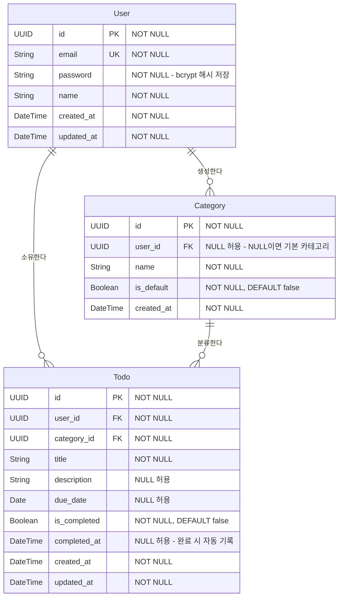

# TodoListApp ERD (Entity Relationship Diagram)

- 버전: 1.0.0
- 작성일: 2026-05-13
- 작성자: Backend Developer
- 참조 문서:
  - [도메인 정의서 v1.0.0](./1-domain-definition.md)
  - [PRD v1.3.0](./2-prd.md)

---

## 변경 이력

| 버전 | 날짜 | 작성자 | 변경 내용 |
|------|------|--------|-----------|
| 1.0.0 | 2026-05-13 | Backend Developer | 최초 작성 — 도메인 정의서 3.1 기반 엔티티 3개(User, Todo, Category) ERD 작성 |

---

## 1. ERD 다이어그램

---

## 2. 엔티티 설명

### 2.1 User (사용자)

서비스를 이용하는 인증된 주체. 모든 할일과 사용자 정의 카테고리의 소유 주체이며, 사용자 식별의 핵심 엔티티이다.

| 속성 | 타입 | 제약 조건 | 설명 |
|------|------|-----------|------|
| id | UUID | PK, NOT NULL | 사용자 고유 식별자 |
| email | String | UNIQUE, NOT NULL | 로그인 및 시스템 전체 식별에 사용하는 이메일 주소 |
| password | String | NOT NULL | bcrypt로 해시 처리된 비밀번호. 평문 저장 금지 |
| name | String | NOT NULL | 사용자 표시 이름 |
| created_at | DateTime | NOT NULL | 회원 가입 일시 |
| updated_at | DateTime | NOT NULL | 정보 마지막 수정 일시 |

### 2.2 Category (카테고리)

할일을 분류하는 그룹 단위 엔티티. 시스템이 사전 제공하는 기본 카테고리(user_id = NULL)와 사용자가 직접 생성하는 사용자 정의 카테고리(user_id = 특정 사용자)로 구분된다.

| 속성 | 타입 | 제약 조건 | 설명 |
|------|------|-----------|------|
| id | UUID | PK, NOT NULL | 카테고리 고유 식별자 |
| user_id | UUID | FK → User.id, NULL 허용 | 소유 사용자 식별자. NULL이면 시스템 기본 카테고리 |
| name | String | NOT NULL | 카테고리 이름 |
| is_default | Boolean | NOT NULL, DEFAULT false | 시스템 기본 카테고리 여부 (true이면 수정/삭제 불가) |
| created_at | DateTime | NOT NULL | 카테고리 생성 일시 |

### 2.3 Todo (할일)

서비스의 핵심 엔티티. 특정 사용자에 귀속되며 반드시 하나의 카테고리로 분류된다. 완료 상태와 종료예정일을 통해 할일의 진행 현황을 추적한다.

| 속성 | 타입 | 제약 조건 | 설명 |
|------|------|-----------|------|
| id | UUID | PK, NOT NULL | 할일 고유 식별자 |
| user_id | UUID | FK → User.id, NOT NULL | 소유 사용자 식별자 |
| category_id | UUID | FK → Category.id, NOT NULL | 분류 카테고리 식별자 |
| title | String | NOT NULL | 할일 제목 |
| description | String | NULL 허용 | 할일 상세 설명 |
| due_date | Date | NULL 허용 | 종료예정일. 입력 시 오늘 이후 날짜여야 함 (애플리케이션 검증) |
| is_completed | Boolean | NOT NULL, DEFAULT false | 완료 여부 플래그 |
| completed_at | DateTime | NULL 허용 | 완료 처리 일시. 완료 시 자동 기록, 미완료 복원 시 NULL로 초기화 |
| created_at | DateTime | NOT NULL | 할일 등록 일시 |
| updated_at | DateTime | NOT NULL | 할일 마지막 수정 일시 |

---

## 3. 관계 설명

| 관계 | 카디널리티 | 설명 |
|------|------------|------|
| User → Todo | 1 : 0..N (일대다) | 한 사용자는 0개 이상의 할일을 소유한다. 할일은 반드시 한 명의 사용자에 귀속된다. |
| User → Category | 1 : 0..N (일대다) | 한 사용자는 0개 이상의 사용자 정의 카테고리를 생성할 수 있다. 기본 카테고리는 user_id = NULL로 시스템 소유이다. |
| Category → Todo | 1 : 0..N (일대다) | 한 카테고리에는 0개 이상의 할일이 속할 수 있다. 할일은 반드시 하나의 카테고리에 속해야 한다 (BR-T-01). |

### 3.1 관계 상세 노트

- **User - Category 관계**: Category.user_id는 NULL을 허용한다. NULL인 경우 해당 카테고리는 시스템 제공 기본 카테고리이며 모든 사용자가 공통으로 사용한다. user_id에 값이 있는 경우 해당 사용자 전용 카테고리이다.
- **User - Todo 관계**: Todo.user_id는 NOT NULL로 반드시 특정 사용자에 귀속된다. 사용자는 자신의 할일만 조회, 수정, 삭제할 수 있다.
- **Category - Todo 관계**: Todo.category_id는 NOT NULL로 할일 등록 시 카테고리 지정이 필수이다. 기본 카테고리와 사용자 정의 카테고리 모두 선택 가능하다.

---

## 4. 주요 제약 조건 (Business Rules)

### 4.1 사용자 관련 제약 (BR-U)

| 규칙 ID | 대상 | 제약 조건 | 적용 레이어 |
|---------|------|-----------|-------------|
| BR-U-01 | User.email | 시스템 전체에서 이메일 고유해야 함. 중복 가입 불가 | DB (UNIQUE 제약) |
| BR-U-02 | User.password | bcrypt 해시 처리 후 저장. 평문 저장 절대 금지 | 애플리케이션 |
| BR-U-03 | 전체 API | 인증되지 않은 사용자는 할일 및 카테고리 기능 접근 불가 | 애플리케이션 (JWT 미들웨어) |
| BR-U-04 | User.email | 가입 후 이메일 변경 불가. 이름과 비밀번호만 수정 허용 | 애플리케이션 |

### 4.2 할일 관련 제약 (BR-T)

| 규칙 ID | 대상 | 제약 조건 | 적용 레이어 |
|---------|------|-----------|-------------|
| BR-T-01 | Todo.category_id | 할일은 반드시 하나의 카테고리에 속해야 함 (NOT NULL) | DB (NOT NULL 제약) |
| BR-T-02 | Todo.title | 할일 제목은 필수 입력값 (NOT NULL) | DB (NOT NULL 제약) |
| BR-T-03 | Todo 전체 | 사용자는 자신이 소유한 할일만 조회, 수정, 삭제 가능. 타인 소유 접근 시 403 반환 | 애플리케이션 |
| BR-T-04 | Todo.completed_at | 완료 처리(is_completed = true) 시 completed_at에 현재 일시 자동 기록 | 애플리케이션 |
| BR-T-05 | Todo.completed_at | 완료 취소(is_completed = false) 시 completed_at을 NULL로 초기화 | 애플리케이션 |
| BR-T-06 | Todo.due_date | 종료예정일은 선택값이나, 입력 시 오늘 날짜 이후여야 함. 과거 날짜 입력 시 오류 반환 | 애플리케이션 |

### 4.3 카테고리 관련 제약 (BR-C)

| 규칙 ID | 대상 | 제약 조건 | 적용 레이어 |
|---------|------|-----------|-------------|
| BR-C-01 | Category (is_default = true) | 기본 카테고리(is_default = true)는 수정 및 삭제 불가 | 애플리케이션 |
| BR-C-02 | Category (user_id = 특정 사용자) | 사용자 정의 카테고리는 해당 사용자만 조회, 수정, 삭제 가능 | 애플리케이션 |
| BR-C-03 | Category 삭제 | 해당 카테고리에 속한 할일이 존재하면 삭제 불가 | 애플리케이션 |
| BR-C-04 | Category.name | 동일 사용자 내에서 카테고리 이름 중복 불가 | 애플리케이션 |

### 4.4 필터링 관련 제약 (BR-F)

| 규칙 ID | 대상 | 제약 조건 | 적용 레이어 |
|---------|------|-----------|-------------|
| BR-F-01 | 할일 목록 조회 | 선택한 카테고리에 속한 할일만 반환 | 애플리케이션 (SQL WHERE) |
| BR-F-02 | 할일 목록 조회 | 현재 날짜 기준 due_date 초과 여부로 기간 종료 필터 적용 | 애플리케이션 (SQL WHERE) |
| BR-F-03 | 할일 목록 조회 | is_completed 값 기준 완료/미완료 필터 적용 | 애플리케이션 (SQL WHERE) |
| BR-F-04 | 할일 목록 조회 | 복수 필터 조건은 AND 조건으로 동시 적용 | 애플리케이션 (SQL WHERE) |

---

*본 문서는 TodoListApp의 데이터베이스 엔티티 관계 정의서이며, 도메인 변경 시 함께 개정됩니다.*
