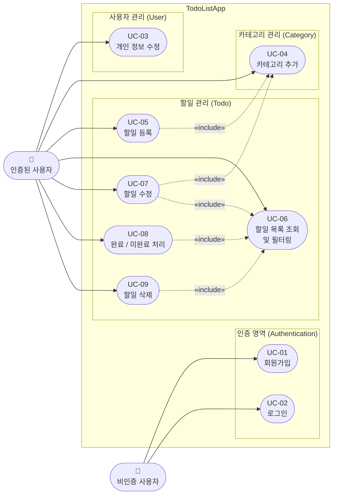

# TodoListApp Use Case Diagram

- 버전: 1.0.0
- 작성일: 2026-05-13
- 참조 문서: [PRD v1.1.0](./2-prd.md)

---

## Use Case Diagram

---

## 액터 정의

| 액터 | 설명 |
|------|------|
| 비인증 사용자 | 회원가입 또는 로그인 이전 상태의 사용자 |
| 인증된 사용자 | 로그인하여 JWT 토큰을 발급받은 사용자. 할일·카테고리 기능 전체에 접근 가능 |

---

## 유스케이스 요약

| UC ID | 유스케이스 | 액터 | 관련 비즈니스 규칙 |
|-------|-----------|------|-------------------|
| UC-01 | 회원가입 | 비인증 사용자 | BR-U-01, BR-U-02 |
| UC-02 | 로그인 | 비인증 사용자 | BR-U-02, BR-U-03 |
| UC-03 | 개인 정보 수정 | 인증된 사용자 | BR-U-04 |
| UC-04 | 카테고리 추가 | 인증된 사용자 | BR-C-01, BR-C-04 |
| UC-05 | 할일 등록 | 인증된 사용자 | BR-T-01, BR-T-02, BR-T-06 |
| UC-06 | 할일 목록 조회 및 필터링 | 인증된 사용자 | BR-F-01, BR-F-02, BR-F-03, BR-F-04 |
| UC-07 | 할일 수정 | 인증된 사용자 | BR-T-01, BR-T-03, BR-T-06 |
| UC-08 | 완료 / 미완료 처리 | 인증된 사용자 | BR-T-03, BR-T-04, BR-T-05 |
| UC-09 | 할일 삭제 | 인증된 사용자 | BR-T-03 |

---

## include 관계 설명

| 관계 | 설명 |
|------|------|
| UC-05 «include» UC-04 | 할일 등록 시 카테고리를 반드시 선택해야 한다 (BR-T-01) |
| UC-07 «include» UC-04 | 할일 수정 시 카테고리를 변경할 수 있으며 카테고리 목록 조회가 필요하다 |
| UC-07 «include» UC-06 | 수정 대상 할일은 목록 조회를 통해 선택된다 |
| UC-08 «include» UC-06 | 완료/미완료 처리 대상 할일은 목록 조회를 통해 선택된다 |
| UC-09 «include» UC-06 | 삭제 대상 할일은 목록 조회를 통해 선택된다 |

---

*본 문서는 PRD를 기반으로 작성된 Use Case Diagram이며, 기능 변경 시 PRD와 함께 개정됩니다.*
